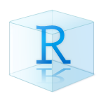
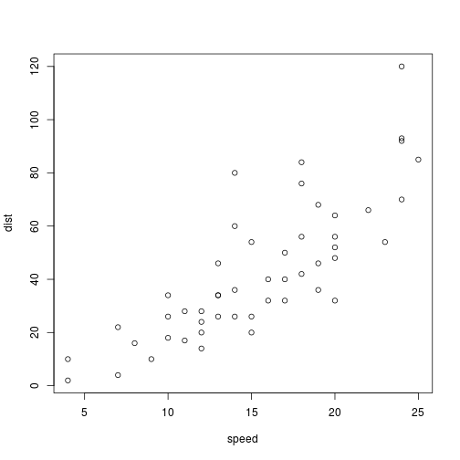

Foundational Skills
========================================================
date: Unit 1: Week 2 Code-Along
author: ECI 588: Text Mining in Education
autosize: false
transition: rotate
font-family: 'Helvetica'

Adapted from:  
Data Science in Education Using R - Chapter 6    <https://datascienceineducation.com>  
Data Science in a Box - Hello World!  
<https://datasciencebox.com>  


Basic Building Blocks of R
========================================================

- RStudio Projects
- Packages
- Functions
- Objects
- Numbers & Strings
- Operators

<!--
Notes... 
-->

RStudio Projects
========================================================
type: section 



<!--
A Project is the home for all of the files, images, reports, and code that are used for data analysis project. 
-->

Why RStudio Projects? 
========================================================

- Projects create a **shareable self-contained folder** for your: 
    + files, images, reports, and code
- Eliminates the need for computer specific files paths like this:  
    >`/Volumes/GoogleDrive/My Drive/College of Ed/Learning Analytics/Courses/ECI 588 Text Mining/R/eci-588/unit-1/img/project.png`
    
- And replaces with this, which anyone can run: 
>`unit-1/img/project.png`


Let's make a project!  
========================================================
type: alert

Let's make a project! 

Slide With Code
========================================================


```r
summary(cars)
```

```
     speed           dist       
 Min.   : 4.0   Min.   :  2.00  
 1st Qu.:12.0   1st Qu.: 26.00  
 Median :15.0   Median : 36.00  
 Mean   :15.4   Mean   : 42.98  
 3rd Qu.:19.0   3rd Qu.: 56.00  
 Max.   :25.0   Max.   :120.00  
```

Slide With Plot
========================================================



