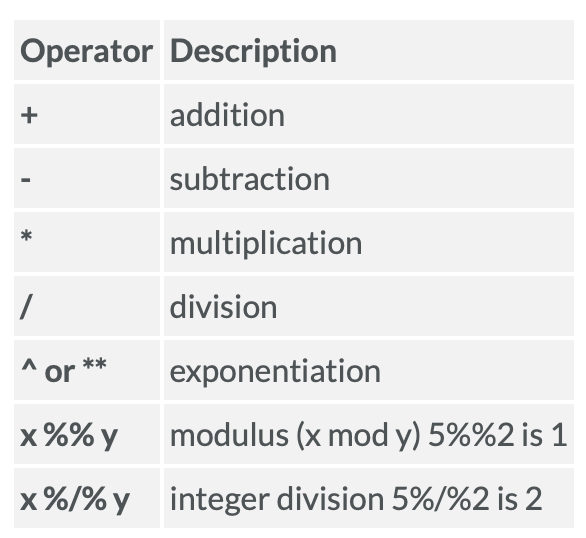
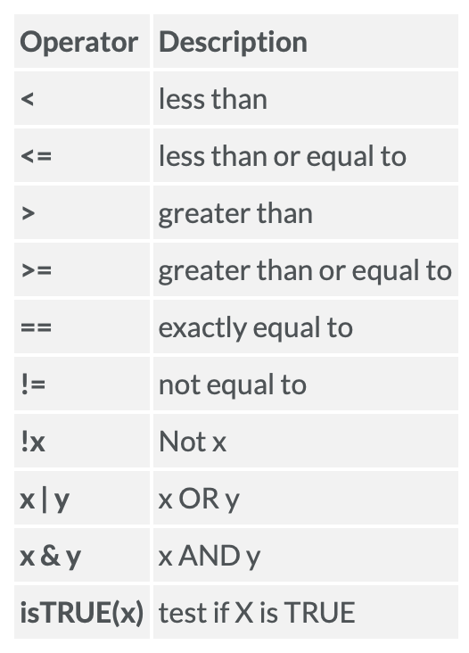
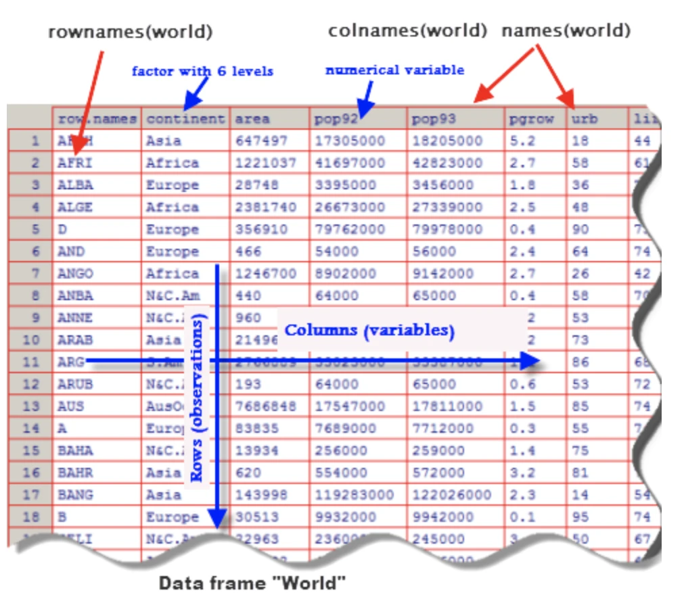

Foundational Skills
========================================================
date: Unit 1: Week 2 Code-Along
author: ECI 588: Text Mining in Education
autosize: false
transition: linear
font-family: 'Helvetica'

Adapted from:  
Data Science in Education Using R - Chapter 6    <https://datascienceineducation.com>  
Data Science in a Box - Hello World!  
<https://datasciencebox.com>  


R Building Blocks
========================================================

1. RStudio Projects
- Numbers & Operators
- Objects & Strings
- Functions
- Packages

<!--
Notes... 
-->

1. RSTUDIO PROJECTS
========================================================
type: section 

  Your home for code, files, reports and more. 

<!--
A Project is the home for all of the files, images, reports, and code that are used for data analysis project. 
-->

Why RStudio Projects? 
========================================================

- Projects create a **shareable self-contained folder** for your: 
    + files, images, reports, code, and subfolders
- Eliminates the need for computer specific files paths like this:  
    >`/Volumes/GoogleDrive/My Drive/College of Ed/Learning Analytics/Courses/ECI 588 Text Mining/R/eci-588/unit-1/img/project.png`
    
- And replaces with this, which anyone can run: 
>`unit-1/img/project.png`


Live Demo
========================================================
type: prompt


**Let's set up a project!**

<!--
Demo creating project.
Demo creating and saving R files

-->


2. NUMBERS & OPERATORS
========================================================
type: section

Arithmetic, Logic, & Assignment

R is a Calculator
========================================================

Numbers and basic arithmetic operators (+ , - , *, /) behave as expected.  
  
Type this in your console:  

```r
2 + 3
```
  
You'll get this:

```
[1] 5
```

---

Arithmetic Operators 



R is Logical
========================================================

R can also perform logical operations.  
  
What happens when you type this in your console?  

```r
5 > 3
```
  
Or this?

```r
5 == 3
```

---

Logical Operators 



3. OBJECTS & DATA
========================================================
type: section

Everything is an object in R!  


Data Types
=========================================================

**Numeric**


```r
my_sum <- 3+3

class(my_sum)
```

```
[1] "numeric"
```

```r
print(my_sum)
```

```
[1] 6
```

------

**Character**


```r
my_daughter <- "Kat"

class(my_daughter)
```

```
[1] "character"
```

```r
my_daughter
```

```
[1] "Kat"
```

Data Types Cont. 
=========================================================

**Vector**


```r
my_vector <- c(1,2,3,4)

class(my_vector)
```

```
[1] "numeric"
```

```r
print(my_vector)
```

```
[1] 1 2 3 4
```

------

**List**


```r
my_list <- c(1,"Kat", 3)

class(my_list)
```

```
[1] "character"
```

```r
my_list
```

```
[1] "1"   "Kat" "3"  
```

Data Types Cont. 
=========================================================

**Matrix**


```r
my_matrix <- matrix(1:9, nrow = 3, ncol = 3)

print(my_matrix)
```

```
     [,1] [,2] [,3]
[1,]    1    4    7
[2,]    2    5    8
[3,]    3    6    9
```

------

**Data Frame**


```r
my_df <- cars


head(my_df)
```

```
  speed dist
1     4    2
2     4   10
3     7    4
4     7   22
5     8   16
6     9   10
```

<!--Text comment-->

Data Frame Example
=========================================================
title: false




Objects Concluded
=========================================================

Aside from being a certain ***class***, objects can have have other attributes, such column names and dimensions:

```r
colnames(my_df)
```

```
[1] "speed" "dist" 
```

```r
dim(my_df)
```

```
[1] 50  2
```

And can even be used with operators! Try this:


```r
my_sum * my_matrix
```


4. FUNCTIONS
========================================================
type: section


Let's Make a Function!
========================================================


PACKAGES
========================================================
type: section 

What's a 

---


<!--
Demo creating project.
Demo creating and saving R files

-->

Slide With Code
========================================================


```r
summary(cars)
```

```
     speed           dist       
 Min.   : 4.0   Min.   :  2.00  
 1st Qu.:12.0   1st Qu.: 26.00  
 Median :15.0   Median : 36.00  
 Mean   :15.4   Mean   : 42.98  
 3rd Qu.:19.0   3rd Qu.: 56.00  
 Max.   :25.0   Max.   :120.00  
```

Slide With Plot
========================================================


