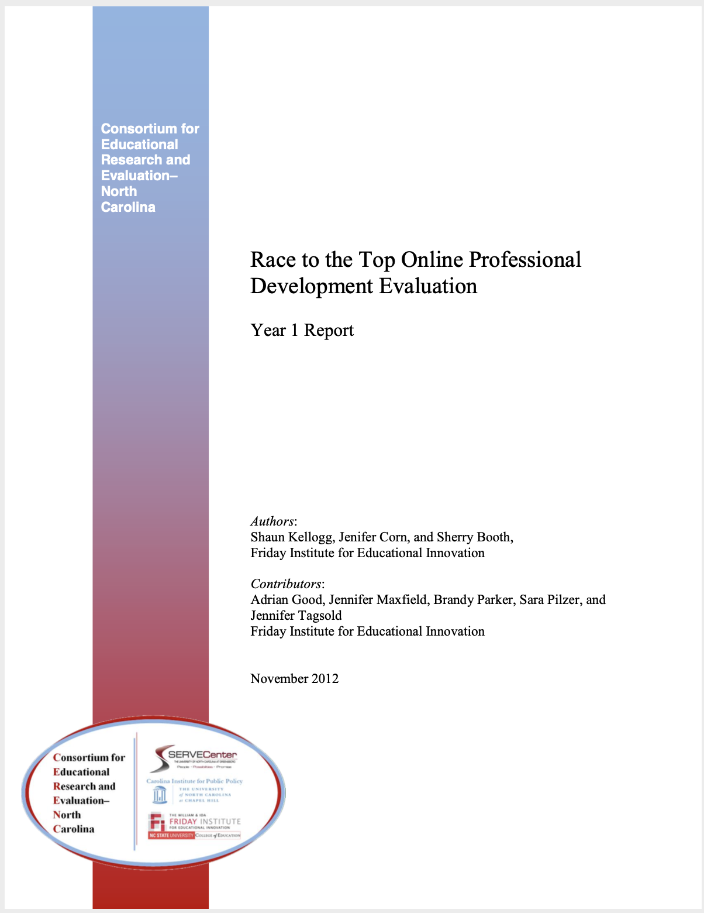

Tidy Text & Word Counts
========================================================
author: ECI 588: Text Mining in Education
date: Unit 1 Guided Walkthrough
autosize: false
transition: linear
font-family: 'Helvetica'

Adapted from:  
Text Mining with R: A Tidy Approach  
<https://www.tidytextmining.com>


What's a Walkthrough?
========================================================
Each unit, we'll **walk through** a basic research workflow, or process for analysis, modeled after Krumm et al. (2018): 


<small>Figure 2.2 Steps of Data-Intensive Research Workflow</small>


<!--
Notes... 
-->

In reality... 
========================================================

 

<small>Figure 2.3 Overlapping Activities Within the Data-Intensive Research Workflow</small>

<!--
Notes... 
--> 


Today's Walkthrough
========================================================

1. **Prepare**: Context, Data, & Questions  
  
2. **Wrangle**: Tidy & Tokenize!
3. **Explore**: Counts, Frequencies, & TF-IDF
4. **Model**: Not until Unit 3 
5. **Communicate**: Week 3: Data Products 

<!--
Notes... 
-->

1. PREPARE
========================================================
type: section

a) Context - Race to the Top (RttT) Online PD  
  
b) Data -  `read` and `view` at our Data

c) Questions - Formulate a Question(s)

<!--
Notes... 
-->


1a. Little Context
========================================================

**Race to the Top** 

NCDPI received $400M for activities and policy reforms to improve education in NC.


**Data Sources** 

Survey of over 15,000 educators participating in online PD. 

**Findings**

Teachers valued convenience, information, and resources. 

---



<!--
Notes... 
-->


1b. Guiding Questions
========================================================

**How do we to quantify what a document or collection of documents is about?**  
  

- What aspects of online professional development offerings do teachers find most valuable?

- How might resources differ in the value they afford teachers?


<!--
Notes... 
-->


1c. Project Setup
========================================================


<!--
Notes... 
-->


2. WRANGLE
========================================================
type: section

a. Read, View, Write

b. Reduce Data

c. Tidy Text


2a. Read, View, Write Data
========================================================

**Reading Data into R**
- `dplyr::read_csv()`

**Viewing Data in RStudio**
- `utils::view()`
- `utils::head()`
- `tibble::glimpse()`

**Writing Data to Project Folder**
- `dplyr::write_csv()`


Reading Data into R (Part 1)
========================================================

1. Download the `opd_survey.csv` file we'll be using for this Unit from our NCSU Moodle course site.
2. Create a folder in directory on your computer where you stored your R Project and name it "data". 
3. Add the file to your data folder.
4. Check your Files tab in R Studio to verify that your file is indeed in your data folder.

Reading Data into R (Part 2)
========================================================


```r
opd_survey <- read_csv("data/opd_survey.csv")
```

Notice that read_csv() dealt with the issues of duplicate column names for us!!

Reading Data into R (Part 3)
========================================================
The lazy way...


2b. Viewing Data
========================================================


```r
#### read data into R #####

dplyr::read_csv()  # read csv files into R

#### view data in R #####

utils::view() # view an object

tibble::glimpse() # like view but transposed

utils::head() # view first 6 rows of your df

utils::tail() # view last 6 rows of your df
```

<!--
Notes... 
-->


2c. Writing Data to Project Folders
========================================================

The **first argument** is the data frame we created earlier

The **second argument** is the file name you plan to give it, including (if necessary) the file path for where it should go. 


```r
write_csv(opd_survey, "data/opd_survey_copy.csv")
```

2. WRANGLE
========================================================
type: section

Context: df 

<!--
Notes... 
-->

  
