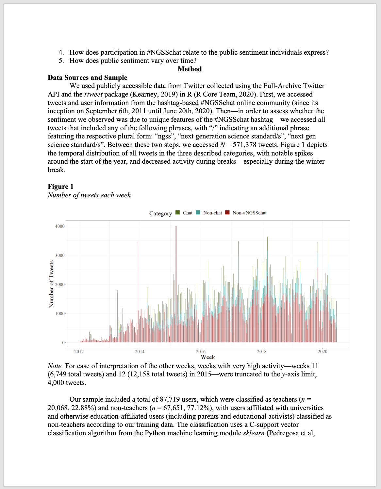
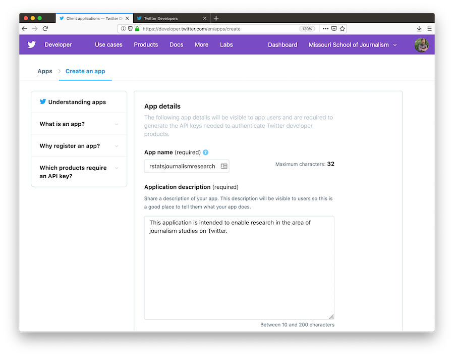

```{r setup, include=FALSE}
knitr::opts_chunk$set(echo = TRUE)
```

## 0. INTRODUCTION

This week, our walkthough is guided by my colleague Josh Rosenberg's
recent article, **Advancing new methods for understanding public
sentiment about educational reforms: The case of Twitter and the Next
Generation Science Standards.** We will focus on conducting a very
simplistic "replication study" by comparing the sentiment of tweets
about the [Next Generation Science
Standards](https://www.nextgenscience.org) (NGSS) and [Common Core State
Standards](http://www.corestandards.org) (CCSS) in order to better
understand public reaction to these two curriculum reform efforts. I
highly recommend you watch the quick 3-minute overview of this work at
<https://stanford.app.box.com/s/i5ixkj2b8dyy8q5j9o5ww4nafznb497x>

### Walkthrough Focus

For Unit 2, our focus will be on using the Twitter API to import data on
topics or tweets of interest and using sentiment lexicons to help gauge
public opinion about those topics or tweets. Specifically, our Unit 2
Walkthrough will cover the following workflow topics:

1.  **Prepare**: Prior to analysis, it's critical to understand the
    context and data sources you're working with so you can formulate
    useful and answerable questions. We'll take a quick look at Dr.
    Rosenberg's study as well as data available through Twitter's API.
2.  **Wrangle**: In section 2 we revisit tidying and tokenizing text
    from Unit 1, and and learn some new functions for appending
    sentiment scores to our tweets using the AFFIN, bing, and nrc
    sentiment lexicons.
3.  **Explore**: In section 3, we use simple summary statistics and
    basic data visualization to compare sentiment between NGSS and CCSS
    tweets.
4.  **Model**: While we won't leverage modeling approaches until Unit 3,
    we will examine the mixed effects model used by Rosenberg et al. to
    analyze the sentiment of tweets
5.  **Communicate:** Finally, in Week 7 we'll create a basic
    presentation, report, or other data product for sharing findings and
    insights from our analysis.

------------------------------------------------------------------------

## 1. PREPARE

To help us better understand the context, questions, and data sources
we'll be using in Unit 2, this section will focus on the following
topics:

a.  **Context**. We take a quick look at the Rosenberg et al. (2021)
    article, *Advancing new methods for understanding public sentiment
    about educational reforms*, including the purpose of the study,
    questions explored, and findings.
b.  **Questions.** We'll formulate some basic questions that we'll use
    to guide our analysis, attempting to replicate some of the findings
    by Rosenberg et al.
c.  **Twitter Setup** We walkthrough the process of setting up R to pull
    data from our Twitter developer account created during the first
    week of the course.

### 1a. Some Context

#### **Twitter and the Next Generation Science Standards**

{width="50%"}

[Full Paper (Preprint)](https://osf.io/xymsd/.)

**Abstract**

While the Next Generation Science Standards (NGSS) are a long-standing
and widespread standards-based educational reform effort, they have
received less public attention, and no studies have explored the
sentiment of the views of multiple stakeholders toward them. To
establish how public sentiment about this reform might be similar to or
different from past efforts, we applied a suite of data science
techniques to posts about the standards on Twitter from 2010-2020 (N =
571,378) from 87,719 users. Applying data science techniques to identify
teachers and to estimate tweet sentiment, we found that the public
sentiment towards the NGSS is overwhelmingly positive---33 times more so
than for the CCSS. Mixed effects models indicated that sentiment became
more positive over time and that teachers, in particular, showed a more
positive sentiment towards the NGSS. We discuss implications for
educational reform efforts and the use of data science methods for
understanding their implementation.

**Data Source & Analysis**

Similar to what we'll be learning in this walkthrough, Roseberg et al.
used publicly accessible data from Twitter collected using the
Full-Archive Twitter API and the `rtweet` package in R. Specifically,
the authors accessed tweets and user information from the hashtag-based
\#NGSSchat online community, all tweets that included any of the
following phrases, with "/" indicating an additional phrase featuring
the respective plural form: "ngss", "next generation science
standard/s", "next gen science standard/s".

Unlike this walkthough, however, the authors determined Tweet sentiment
using the Java version of SentiStrength to assign tweets to two 5-point
scales of sentiment, one for positivity and one for negativity, because
SentiStrength is a validated measure for sentiment in short informal
texts (Thelwall et al., 2011). In addition, we used this tool because
Wang and Fikis (2019) used it to explore the sentiment of CCSS-related
posts. We'll be using the AFINN sentiment lexicon which also assigns
words in a tweet to two 5-point scales, in addition to explore some
other sentiment lexicons.

Note that the authors also used the `lme4` package in R to run a mixed
effects model to determine if sentiment changes over time and differs
between teachers and non-teacher. We will not attempt replicated that
aspect of the analysis, but if you are interested in a guided walkthough
of how modeling can be used to understand changes in Twitter word use,
see [Chapter 7 of Text Mining with
R](https://www.tidytextmining.com/twitter.html#changes-in-word-use).

**Summary of Key Findings**

1.  Contrasting with sentiment about CSSS, sentiment about the NGSS
    science education reform effort is overwhelmingly positive, with
    approximately 9 positive tweets for every negative tweet.
2.  Teachers were more positive than non-teachers, and sentiment became
    substantially more positive over the ten yearsof NGSS-related posts.
3.  Differences between the context of the tweets were small, but those
    that did not include the \#NGSSchat hashtag became more positive
    over time than those posts that did not include the hashtag.
4.  Individuals posted more tweets during \#NGSSchat chats, the
    sentiment of their posts was more positive, suggesting that while
    the context of individual tweets has a small effect (with posts not
    including the hashtag becoming morepositive over time), the effect
    upon individuals of being involved in the \#NGSSchat was positive.

### 1b. Guiding Questions

The Rosenberg et al. study was guided by the following five research
questions:

1.  What is the public sentiment expressed toward the NGSS?
2.  How does sentiment for teachers differ from non-teachers?
3.  How do tweets posted to \#NGSSchat differ from those without the
    hashtag?
4.  How does participation in \#NGSSchat relate to the public sentiment
    individuals express?
5.  How does public sentiment vary over time?

For this walkthrough, we'll use a similar approach used by the authors
to guage public sentiment around the NGSS, by compare how much more
positive or negative NGSS tweets are relative to CSSS tweets.

Our (very) specific questions of interest for this walkthrough are:

1.  What is the public sentiment expressed toward the NGSS?
2.  How does sentiment for NGSS compare to sentiment for CCSS?

And just to reiterate from Unit 1, one overarching question we'll
explore throughout this course, and that Silge and Robinson (2018)
identify as a central question to text mining and natural language
processing, is:

> How do we to **quantify** what a document or collection of documents
> is about?

### 1c. Set Up

As highlighted in [Chapter 6 of Data Science in Education Using
R](https://datascienceineducation.com/c06.html) (DSIEUR), one of the
first steps of every workflow should be to set up a "Project" within
RStudio. This will be your "home" for any files and code used or created
in Unit 2. You are welcome to continue using the same project created
for Unit 1, or create an entirely new project for Unit 2. However, after
you've created your project open up a new R script, and load the
following packages that we'll be needing for this walkthrough:

```{r, message=FALSE}
library(dplyr)
library(readr)
library(tidyr)
library(rtweet)
library(tidytext)
library(ggplot2)
library(textdata)
library(scales)
```

At the end of this week, I'll ask that you share with me your r script
as evidence that you have complete the walkthrough. Although I highly
recommend that that you manually type the code shared throughout this
walkthrough, for large blocks of text it may be easier to copy and
paste.

#### Create a Twitter App

Before you can begin pulling tweets into R, you'll first need to create
a Twitter App in your developer account. You are not required to set up
developer account for this course, but if you are still interested in
creating one, [these
instructions](https://dev.to/sumedhpatkar/beginners-guide-how-to-apply-for-a-twitter-developer-account-1kh7)
succinctly outline the process and you can set one up in about 10
minutes. If you are not interested in setting one up and pulling tweets
on your own, I have provided the data we'll be using for this tutorial
in

This walkthrough, borrowed largely from `rtweet` package developer
Michael Kearney, is for those of you have a set up a Twitter developer
account and are interested in pulling your own data for Twitter.

-   Once you have acquired a developer account, navigate to
    [developer.twitter.com/en/apps](https://developer.twitter.com/en/apps/),
    click the blue button that says, `Create a New App`, and then
    complete the form with the following fields:

    -   `App Name`: What your app will be called

    -   `Application Description`: How your app will be described to its
        users

        <p align="center">

        

        </p>

    -   `Website URLs`: Website associated with app--I recommend using
        the URL to your Twitter profile

    -   `Callback URLs`: ***IMPORTANT*** enter exactly the following:
        `http://127.0.0.1:1410`

        <p align="center">

        

        </p>

    -   `Tell us how this app will be used`: Be clear and honest

        <p align="center">

        

        </p>

-   When you've completed the required form fields, click the blue
    `Create` button at the bottom

-   Read through and indicate whether you accept the developer terms

    <p align="center">

    

    </p>

-   And you're done!

    <p align="center">

    

    </p>

#### Authorization methods

Users can create their personal Twitter token in two different ways.
Each method is outlined below.

-   Navigate to
    [developer.twitter.com/en/apps](https://developer.twitter.com/en/apps)
    and select your Twitter app
-   Click the tab labeled `Keys and tokens` to retrieve your keys.
-   Locate the `Consumer API keys` (aka "API Secret").

<p align="center">


</p>

-   Scroll down to `Access token & access token secret` and click
    `Create`

<p align="center">


</p>

-   Copy and paste the four keys (along with the name of your app) into
    an R script file and pass them along to `create_token()`.

```{r}
## store api keys (these are fake example values; replace with your own keys)
api_key <- "afYS4vbIlPAj096E60c4W1fiK"
api_secret_key <- "bI91kqnqFoNCrZFbsjAWHD4gJ91LQAhdCJXCj3yscfuULtNkuu"
access_token <- "9551451262-wK2EmA942kxZYIwa5LMKZoQA4Xc2uyIiEwu2YXL"
access_token_secret <- "9vpiSGKg1fIPQtxc5d5ESiFlZQpfbknEN1f1m2xe5byw7"

## authenticate via web browser
token <- create_token(
  app = "rstatsjournalismresearch",
  consumer_key = api_key,
  consumer_secret = api_secret_key,
  access_token = access_token,
  access_secret = access_token_secret)
```

## Authorization in future R sessions

-   The `create_token()` function should automatically save your token
    as an environment variable for you. So next time you start an R
    session [on the same machine], rtweet should automatically find your
    token.
-   To make sure it works, restart your R session, run the following
    code, and again check to make sure the app name and `api_key` match.

```{r}
## check to see if the token is loaded
library(rtweet)
get_token()
```

That's it!

------------------------------------------------------------------------

## 2. WRANGLE

In general, data wrangling involves some combination of cleaning,
reshaping, transforming, and merging data (Wickham & Grolemund, 2017).
The importance of data wrangling is difficult to overstate, as it
involves the initial steps of going from raw data to a dataset that can
be explored and modeled (Krumm et al, 2018).

a.  **Import Data**. In this section...
b.  **Data Reduction**. We focus on tools from the `dplyr` package to
    view, `rename`, select, slice, and filter our data in preparation
    for analysis.
c.  **Tidy Text**. We'll learn how to use the `tidytext` package to both
    "tidy" and tokenize our text in order to create a data frame to use
    for analysis.

### 2a. Read, View, Write Data

The Reading Data section introduces the following functions for reading
data into R and inspecting it's contents:

-   `dplyr::read_csv()` Reading .csv files into R.
-   `base::print()` View your data frame in the Console Pane
-   `utils::view()` View your data frame in the Source Pane
-   `tibble::glimpse()` Like print, but transposed so you can see all
    columns
-   `utils::head()` View the first 6 rows of your data.
-   `utils::tail()` View last 6 rows of your data.
-   `dplyr::write_csv()` writing .csv files to directory.

Remember, the name before the double colon indicates the package the
function comes from. For example, `read_csv` comes from the \`readr\`\`
package.

#### Reading Data into R

To get started, we need to import, or "read", our data into R. The
function used to import your data will depend on the file format of the
data you are trying to import.

1.  Download the `opd_survey.csv` file we'll be using for this Unit from
    our NCSU Moodle course site.
2.  Create a folder in directory on your computer where you stored your
    R Project and name it "data".
3.  Add the file to your data folder.
4.  Check your Files tab in R Studio to verify that your file is indeed
    in your data folder.

Now let's read our data into our Environment and assign it to a variable
name so we can work with it like any other object in R.

```{r, eval = FALSE}
opd_survey <- read_csv("data/opd_survey.csv")
```

```{r, echo=FALSE}
opd_survey <- read_csv("/Volumes/GoogleDrive/My Drive/College of Ed/Data/opd_survey.csv")
```

Notice that `read_csv()` dealt with the issues of duplicate column names
for us!!

If you happen to run into issues with data import, RStudio as has an
Import Dataset feature for a point and click approach to adding data to
your environment. Be sure to pay attention to the

{width="70%"}

#### Viewing Data in RStudio

Once your data is in R, there are many different ways you can view it.
Give each of the following at try:

```{r, eval=F}
# enter the name of your data frame and view directly in console 
opd_survey 

# view your data frame transposed so your can see every column and the first few entries
glimpse(opd_survey) 

# look at just the first six entries
head(opd_survey) 

# or the last six entries
tail(opd_survey) 

# view the names of your variables or columns
names(opd_survey) 

# or view in source pane
view(opd_survey) 

```

#### Writing Data to your Project Folder

In addition to reading data from your project folder, you can also write
data back to a folder. The `readr` package has an intuitively named
`write_csv()` function for doing just that.

Using the following code to create a copy of the opd_survey.csv file in
your data folder from the `opd_survey` data frame you created:

```{r, eval=F}
write_csv(opd_survey, "data/opd_survey_copy.csv")
```

Note that the first argument is the data frame you created earlier and
the second argument is the file name you plan to give it, including (if
necessary) the file path for where it should go.

#### Comprehension Check

Throughout this walkthrough, you will be asked to respond to questions
or short tasks to check your comprehension of the content covered. For
section 2a. Read, View, and Write Data, please respond to these
questions by commenting out a line or lines in your R script like so:

```{r, eval = F}
# 1. What argument would you add to `read_csv()` if my file did not not have column names or headers? 

# I would need to add the ____ argument and set it to equal ____ to prevent R from setting the first row as column names. 

```

1.  What argument would you add to `read_csv()` if my file did not not
    have column names or headers? You can type `?read_csv` to get help
    on this function or check this handy [cheatsheet for the readr
    package](https://github.com/rstudio/cheatsheets/blob/master/data-import.pdf)
    from the `readr` website at <https://readr.tidyverse.org/index.html>
2.  What is the first argument that `read_csv()` always expects and what
    happens if you don't include in quotes?
3.  What package would I need if I wanted to read a Microsoft Excel file
    into R? Hint: Check the cheatsheet.
4.  What are some of the pros and cons of `view()` compared to other
    functions for viewing your data?
5.  What happens if you use
    `write_csv(opd_survey, "opd_survey_copy.csv")` and just specify the
    file name instead including the folder?
6.  What immediate data wrangling issues do you anticipate we'll have to
    deal with now that you've looked at our data?

### 2b. Reduce Data

As you've probably already noticed from viewing our dataset, we clearly
have more data than we need to answer our rather basic research
question. For this part of our workflow we focus on the following
functions from the [`dplyr` package](https://dplyr.tidyverse.org) for
wrangling our data:

[**`dplyr`**](https://dplyr.tidyverse.org) **functions**

-   `select()` picks variables based on their names.
-   `slice()` lets you select, remove, and duplicate rows.
-   `rename()` changes the names of individual variables using new_name
    = old_name syntax
-   `filter()` picks cases, or rows, based on their values in a
    specified column.

[**`stats`**]() **functions**

-   `na.omit()` a handy little function from the `stats` package for
    removing rows with missing values, i.e. NA.

#### Subset Columns

To begin, let's `select()` Role, Resources, and Q21 columns and store as
new data frame since those respectively pertain to educator role, OPD
resource they are evaluating, and, as illustrated by the second row,

```{r}
opd_selected <- select(opd_survey, Role, Resource, Q21)
```

Notice that like the bulk of all tidyverse functions, the first input
`select()` expects is a data frame, followed by the columns you'd like
to select.

Let's take a look at our newly created data frame that should have
dramatically fewer variables:

```{r}
head(opd_selected)
```

#### Rename Columns

Notice that Q21 is not a terribly informative variable name. Let's now
take our `opd_selected` data frame and use the `rename()` function along
with the `=` assignment operator introduced last week to change the name
from Q21 to "text" and save it as `opd_renamed`.

This naming is somewhat intentional because not only is it the text we
are interested in analyzing, but also mirrors the naming conventions in
our [Text Mining with R]<https://www.tidytextmining.com/tidytext.html>
course book and will make it easier to follow the examples there.

```{r}
opd_renamed <- rename(opd_selected, text = Q21)
```

#### Subset Rows

Now let's deal with the legacy rows that Qualtrics outputs by default,
which are effectively 3 sets of headers. We will use the `slice()`
function, which is basically the same as the `select()` function but for
rows instead of columns, to carve out those two rows.

```{r}
opd_sliced <- slice(opd_renamed, -1, -2) # the - sign indicates to NOT keep rows 1 and 2

head(opd_sliced)
```

Now let's take our `opd_sliced` and remove any rows that are missing
data, as indicated by an `NA`.

```{r}
opd_complete <- na.omit(opd_sliced)
```

Finally, since we are only interested in the feedback from teachers,
let's also filter our dataset for only participants who indicated their
`Role` as "Teacher".

```{r}
opd_teacher <- filter(opd_complete, Role == "Teacher")

head(opd_teacher)
```

That was a lot of code we just wrote to end up with `opd_teacher`. Let's
review:

```{r,eval=FALSE}
opd_selected <- select(opd_survey, Role, Resource, Q21)
opd_renamed <- rename(opd_selected, text = Q21)
opd_sliced <- slice(opd_renamed, -1, -2)
opd_complete <- na.omit(opd_sliced)
opd_teacher <- filter(opd_complete, Role == "Teacher")
```

Note that we could have reused `opd_teacher` and simply overwritten it
each time to prevent creating new objects:

```{r,eval=F}
opd_teacher <- select(opd_survey, Role, Resource, Q21)
opd_teacher <- rename(opd_teacher, text = Q21)
opd_teacher <- slice(opd_teacher, -1, -2)
opd_teacher <- na.omit(opd_teacher)
opd_teacher <- filter(opd_teacher, Role == "Teacher")
```

#### Code Reduction

Fortunately, we can use the Pipe Operator `%>%` introduced in [Chapter 6
of Data Science in Education Using R
(DSIEUR)](https://datascienceineducation.com/c06.html) to dramatically
simplify these cleaning steps and reduce the code written

```{r}
opd_teacher <- opd_survey %>%
  select(Role, Resource, Q21) %>%
  rename(text = Q21) %>%
  slice(-1, -2) %>%
  na.omit() %>%
  filter(Role == "Teacher")

head(opd_teacher)
```

Our dataset is now ready to be tidied!!!

#### Comprehension Check

1.  How would you change the code in the Subset Columns section if you
    wanted to analyze how educators are are using the online resources
    instead of the most beneficial aspects?
2.  How would you rewrite the code in the Subset Rows section if you
    were interested in looking at School Executive responses instead of
    teachers?
3.  Rewrite the piped code in the Code Reduction section to prepare a
    data frame for tidying that includes all Roles, not just teachers,
    but excludes the Resource column. Assign it to `opd_benefits` for
    later use.

### 2c. Tidy Text

For this part of our workflow we focus on the following functions from
the [`tidytext`](https://cran.r-project.org/web/packages/tidytext/) and
`dplyr` packages respectively:

-   `unnest_tokens()` splits a column into tokens
-   `anti_join()` returns all rows from x with**out** a match in y.

#### Tidy Data Principles

Not surprisingly, the Tidyverse set of packages including packages like
`dplyr` adhere "tidy" data principles [(Wickham
2014)](https://www.jstatsoft.org/article/view/v021i12). Tidy data has a
specific structure:

-   Each variable is a column
-   Each observation is a row
-   Each type of observational unit is a table

Why would this data be considered "untidy"?

{width="100%"}

Text data, by it's very nature is ESPECIALLY untidy. In [Chapter 1 of
Text Mining with R](https://www.tidytextmining.com/tidytext.html), Silge
and Robinson define the tidy text format as

> <small>**a table with one-token-per-row**. A token is a meaningful
> unit of text, such as a word, that we are interested in using for
> analysis, and tokenization is the process of splitting text into
> tokens. This one-token-per-row structure is in contrast to the ways
> text is often stored in current analyses, perhaps as strings or in a
> document-term matrix. For tidy text mining, the **token** that is
> stored in each row is most often a single word, but can also be an
> n-gram, sentence, or paragraph. In the tidytext package, we provide
> functionality to tokenize by commonly used units of text like these
> and convert to a one-term-per-row format.</small>

In this section, our goals is to transform our `opd_teacher` data from
this:

```{r, echo=F}
head(opd_teacher)
```

to this:

```{r, echo=F}
opd_tidy <- unnest_tokens(opd_teacher, word, text)

head(opd_tidy)
```

#### Tokenize Text

In order to tidy our text, we need to break the text into individual
tokens (a process called tokenization) and transform it to a tidy data
structure. To do this, we use tidytext's incredibly powerful
`unnest_tokens()` function.

After all the work we did prepping our data, this is going to feel a
little anticlimactic.

Let's go ahead and tidy our text and save it as `opd_tidy`:

```{r}
opd_tidy <- unnest_tokens(opd_teacher, word, text)

head(opd_tidy)
```

Note that we also could have just added `unnest_tokens(word, text)` to
our previous piped chain of functions like so:

```{r}
opd_tidy <- opd_survey %>%
  select(Role, Resource, Q21) %>%
  rename(text = Q21) %>%
  slice(-1, -2) %>%
  na.omit() %>%
  filter(Role == "Teacher") %>%
  unnest_tokens(word, text)

head(opd_tidy)
```

There is A LOT to unpack with this function. First notice that
`unnest_tokens` expects a data frame as the first argument, followed by
two column names. The first is an output column name that doesn't
currently exist but will be created as the text is unnested into it
(`word`, in this case). This if followed by the input column that the
text comes from which we uncreatively named `text`. Also notice:

-   Other columns, such as `Role` and `Resource`, are retained.
-   All punctuation has been removed.
-   Tokens have been changed to lowercase, which makes them easier to
    compare or combine with other datasets. However, we can use the
    `to_lower = FALSE` argument to turn off this behavior).

#### Remove Stop Words

One final step in tidying our text is to remove words that don't add
much value to our analysis (at least when using this approach) such as
"and", "the", "of", "to" etc. The `tidytext` package contains a
`stop_words` dataset derived from three different lexicons that we'll
use to remove rows that match words in this dataset.

Let's take a look at these common stop words so we know what we're
getting rid of from our `opd_tidy` dataset.

```{r}
head(stop_words)
```

In order to remove these stop words, we will use function called
`anti_join()` that looks for matching values in a specific column from
two datasets and returns rows from the original dataset that have no
matches. For a good overview of the different `dplyr` joins see here:
<https://medium.com/the-codehub/beginners-guide-to-using-joins-in-r-682fc9b1f119>

{width="80%"}

Let's remove rows from our `opd_tidy` data frame that contain matches in
the `word` column with those in the `stop_words` dataset and save it as
`opd_clean` since we were done cleaning our data at this point.

```{r}
opd_clean <- anti_join(opd_tidy, stop_words)

head(opd_clean)
```

#### Comprehension Check

1.  How would you include the `anti_join()` function in our previous
    chain that uses the pipe operator? Give it a try and see what
    happens.
2.  Why do you think the console provided the message "Joining, by =
    'word'"?
3.  How would you use `anti_join()` if we had named the output column
    from `unnest_tokens()` "tokens" instead? Hint: Check ?anti_join
    documentation.
4.  Tidy your opd_benefits data by tokenizing your text and removing
    stop words.

------------------------------------------------------------------------

## 3. EXPLORE

As highlighted in both DSEIUR and Learning Analytics Goes to School,
calculating summary statistics, data visualization, and feature
engineering (the process of creating new variables from a dataset) are a
key part of exploratory data analysis. One goal in this phase is explore
questions that drove the original analysis and develop new questions and
hypotheses to test in later stages. In Section 3, we will calculate some
very basic summary statistics from our tidied text, explore key words of
interest to gather additional context, and use data visualization to
identify patterns and trends that may not be obvious from our tables and
numerical summaries. Topics addressed in Section 3 include:

a.  **Summary Stats**. We focus primarily on the use of word counts and
    calculating proportions to to help us identify common words used to
    describe the most valuable aspects of online professional
    development offerings.
b.  **Word Search**. We learn about the global regular expression
    parser, or `grep` package in R, to search for key words among our
    data set.
c.  **Data Visualization**. Finally, we wrap up this walkthrough and
    preview our work for next week by creating wordclouds, bar plots,
    and small multiple charts to explore patterns and trends that would
    be difficult to distinguish otherwise.

### 3a. Summary Stats

Prior to making any data visualization, we revisit our or overarching
question guiding most of our efforts in this course, "How do we
**quantify** what a text is about?"

In this section, we introduce the following functions:

[**`dplyr`**](https://dplyr.tidyverse.org) **functions** -
[`count()`](https://dplyr.tidyverse.org/reference/count.html?q=count)
lets you quickly count the unique values of one or more variables -
[`group_by()`](https://dplyr.tidyverse.org/articles/grouping.html?q=group)
takes a data frame and one or more variables to group by -
[`summarise()`](https://dplyr.tidyverse.org/reference/summarise.html) -
[`mutate()`](https://dplyr.tidyverse.org/reference/mutate.html) adds new
variables and preserves existing ones -
[`left_join()`](https://dplyr.tidyverse.org/reference/mutate-joins.html?q=join)
add columns from one dataset to another

[**`tidytext`**](https://cran.r-project.org/web/packages/tidytext/index.html)
**functions** -
[`bind_tf_idf()`](https://cran.r-project.org/web/packages/tidytext/tidytext.pdf)
binds the term frequency and inverse document frequency of a tidy text
dataset to the dataset

#### Word Counts

As highlighted in [Word Counts are
Amazing](https://tedunderwood.com/2013/02/20/wordcounts-are-amazing/),
one simple but powerful approach to text analysis is counting the
frequency in which words occur in a given collection of documents, or
corpus.

Now that we have our original survey data in a tidy text format, we can
use the `count()` function from the `dplyr` package to find the most
common words used by teachers when asked, "What was the most
beneficial/valuable aspect of this online resource?"

```{r}
opd_counts <- count(opd_clean, word, sort = TRUE)

# alternatively, we could have use the %>% operator to yield the same result.

opd_counts <- opd_clean %>% 
  count(word, sort = TRUE)

opd_counts
```

Going back to findings from the original report, a strategy as simple
basic word counts resulted in key words consistent with findings from
the qualitative analysis of focus-group transcripts and open-ended
survey responses:

> Educators frequently cited that the **information and resources**
> provided through the modules improved their understanding of the new
> standards and the teacher evaluation process.

See also this finding around video clips:

> Webinar participants appreciated the useful, updated information
> presented through a combination of PowerPoint slides and **video
> clips**.

One notable distinction between word counts and more traditional
qualitative analysis is that broader themes like "convenience" often are
not immediately apparent in words counts, but rather emerges from
responses containing words like "pace", "format", "online", "ease", and
"access".

> A common theme from focus groups and open-ended survey responses was
> the **convenience** of online professional development. One teacher in
> a focus group stated, "I liked the format. And the way that it was
> given, it was at your own pace, which works well for our schedules..."

The `count()` function can also be used with more than one column to
count the frequency a word occurs for a select `Resource` in our
dataset.

```{r}
opd_resource_counts <- opd_clean %>%
  count(Resource, word, sort = TRUE)

```

In this case, we see that "information" was the most common word for
Online Learning Modules but did not even make the top 5 for Recorded
Webinar:

{width="80%"}

#### Word Frequencies

One common approach to facilitate comparison across documents or groups
of text, in our case responses by Online Resource type, is by looking at
the frequency that each word occurs among all words for that document
group. This also helps to better gauge how prominent the same word is
across different groups.

For example, let's create counts for each `Resource` and `word` paring,
and then create a new column using the `mutate()` function that
calculations the proportion that word makes up among all words.

To do this a little more efficiently, I'm going to use the %\>%
operator:

```{r}
opd_frequencies <- opd_clean %>%
  count(Resource, word, sort = TRUE) %>%
  group_by(Resource) %>%
  mutate(proportion = n / sum(n))

opd_frequencies
```

Using the `view()` function we can see that "information" makes up about
2.3% of words in responses about the Online Modules, and about 1.7% for
Recorded Webinars.

#### Term Frequency-Inverse Document Frequency

Term frequency-inverse document frequency (tf-idf) is an approach that
takes this approach one step further.

As noted in [Tidy Text Mining with
R](https://www.tidytextmining.com/tfidf.html):

> The statistic tf-idf is intended to measure how important a word is to
> a document in a collection (or corpus) of documents, for example, to
> one novel in a collection of novels or to one website in a collection
> of websites.

Silge and Robinson note that, "The idea of tf-idf is to find the
important words for the content of each document by decreasing the
weight for commonly used words and increasing the weight for words that
are not used very much in a collection or corpus of document... That is,
tf-idf attempts to find the words that are important (i.e., common) in a
text, but not too common."

The `tidytext` package has a function called `bind_tf_idf()` that takes
a tidy text dataset as input with one row per token (term), per
document. One column (word here) contains the terms/tokens, one column
contains the documents (book in this case), and the last necessary
column contains the counts, how many times each document contains each
term (n in this example).

Because tf-idf can account through weighting for "too common" words like
"and" or "but", when calculating tf-idf it is not necessary to remove
stop words. However, we will need add a column for total words for each
`Resource` type which can be accomplished in a couple of steps.

First, let's recycle our `opd_teacher` data frame and calculate counts
for each word again, but this time instead of word counts for the total
data set, we'll calculate word counts for each 'Resource'.

```{r}
opd_words <- opd_teacher %>%
  unnest_tokens(word, text) %>%
  count(Resource, word, sort = TRUE)

head(opd_words)
```

Next, let's calculate the total words per `Resource` type:

```{r}
total_words <- opd_words %>%
  group_by(Resource) %>%
  summarise(total = sum(n))

total_words
```

Now let's append the `total` column from `total_words` to our
`opd_words` data frame:

```{r}
opd_totals <- left_join(opd_words, total_words)

opd_totals
```

Finally, we're ready to use the `bind_tf_idf()` function to calculate a
tf-idf statistic for each word and assess it's relative importance to a
given online resource type:

```{r}
opd_tf_idf <- opd_totals %>%
  bind_tf_idf(word, Resource, n)

opd_tf_idf
```

Notice that idf and thus tf-idf are zero for these extremely common
words (typically stop words). These are all words that appear in teacher
responses for all online resource types, so the idf term (which will
then be the natural log of 1) is zero. The inverse document frequency
(and thus tf-idf) is very low (near zero) for words that occur in many
of the documents in a collection; this is how this approach decreases
the weight for common words. The inverse document frequency will be a
higher number for words that occur in fewer of the documents in the
collection.

On one final note, while it has proved useful in text mining, search
engines, etc., its theoretical foundations are considered less than firm
by information theory experts..."

In the next section, we'll use some data visualization strategies to
help us interpret and find patterns in these rather dense output tables.

#### Comprehension Questions

1.  Looking back at the Word Counts section, what other aspects of the
    online professional development resources to our word counts suggest
    teachers find valuable or beneficial?
2.  Instead of using the view() function for `opd_resource_counts` and
    searching in the source how, how might you use the `filter()`
    function to find return the most common words for Recorded Webinars?
3.  How many total resources were actually evaluated and which resource
    received the most feedback? How do you know?
4.  What are some obvious limitations to tf-idf, at least for this
    dataset, based on the initial `opd_tf_idf` data frame we created?
5.  Calculate word counts, frequencies, and tf-idf for you
    `opd_benefits` data frame. For frequencies and tf-idf, group by Role
    instead of Resource.
6.  What differences, if any, do you notice between teachers and other
    roles?

### 3b. Word Search

This section is a really quick aside and primarily meant to introduce
the `grep` package that we'll be using in future units.

A quick word count actually resulted in findings fairly consistent with
some of the qualitative findings reported, but also lacked some nuance,
unsurprisingly, and left some questions about what some of the more
frequent words were in reference to.

Let's use our reduced opd_teacher survey data frame that contains the
complete teacher responses and use the handy `filter()`, `select()` and
`grepl()` function to select just our `text` column and filter out
responses that contain key words of interest. For example, what aspects
of "online" made it beneficial.

We can view all quotes in the source pane, or use the `sample_n()`, yes
from the `dplyr` package, to select any number of random quotes. In this
case 20:

```{r}
opd_quotes <- opd_teacher %>%
  select(text) %>% 
  filter(grepl('online', text))

sample_n(opd_quotes, 20)
```

In some cases, we can see that the use of the word "online" was simply
repetition of the question prompt, but in other cases we can see that
it's associated with the broader theme of "convenience" as with the
quote, "This online resources gave me the opportunity to study on my own
time."

Note that you can also use regular express operators with `grep` like
the `*` operator to search for word stems. For example using `inform*`
in our search will return quotes with "inform", "informative",
"information", etc.

```{r}
opd_quotes <- opd_teacher %>%
  select(text) %>% 
  filter(grepl('inform*', text))

sample_n(opd_quotes, 20)
```

### 3c. Data Visualization

We covered data visualization pretty extensively in ECI 586:
Introduction to Learning Analytics, but for those new to data
visualization in R, the go to package for standard charts and graphs is
[`ggplot2`](https://ggplot2.tidyverse.org). Hadley Wickham's [R for Data
Science](https://r4ds.had.co.nz/data-visualisation.html) and [ggplot2:
Elegant Graphics for Data] are also great introductions to data
visualization in R with ggplot2.

#### Word Clouds

The `wordcloud2` packages is pretty dead simple for generating HTML
based word clouds.

For example, let's load our installed `wordclouds2` library, and run the
`wordcloud2()` function on our `opd_counts` data frame:

```{r}
library(wordcloud2)

wordcloud2(opd_counts)
```

I use wordclouds pretty sparingly in evaluation reports, but typically
include them for open ended items in online Qualtrics survey reports to
provide education partners I work with a quick snapshot of the response.

Once installed, I recommend using `?wordclouds2` to view the various
arguments for cleaning up the default view.

#### Basic Bar Chart

The bar chart is the workhorse for data viz and is pretty effective for
comparing two or more values. Given the unique aspect of our tidy text
data frame, however, we are looking at upwards of over 5,000 values
(i.e. words and their counts) to compare with our `opd_counts` data
frame and will need some way to limit the number of words to display.

```{r}
opd_counts %>%
  filter(n > 500) %>% # keep rows with word counts greater than 500
  mutate(word = reorder(word, n)) %>% #reorder the word variable by n and replace with new variable called word
  ggplot(aes(n, word)) + # create a plot with n on x axis and word on y axis
  geom_col() # make it a bar plot
```

#### Small Multiples

Word clouds and bar charts are pretty effective for highlighting the
most common words in an entire corpus, or in our case, all teacher
survey responses, regarless of resource type being reviewed.

One limitation we ran into earlier when we started looking at word
frequencies and tf-idf stats was that it was difficult to easily compare
the most common or unique words for each resource type. That is where
small multiples come. A small multiple is basically a series of similar
graphs or charts using the same scale and axes that make it easier to
compare across different document collections of interest, in our case,
word counts by resource type.

Let's use the example illustrated in Text Mining with R to create a
small multiple for our `opd_frequencies` data set instead of the
`opd_tf_idf`

```{r}
library(forcats)

opd_frequencies %>%
  filter(Resource != "Calendar") %>% # remove Calendar responses, too few. 
  group_by(Resource) %>%
  slice_max(proportion, n = 5) %>%
  ungroup() %>%
  ggplot(aes(proportion, fct_reorder(word, proportion), fill = Resource)) +
  geom_col(show.legend = FALSE) +
  facet_wrap(~Resource, ncol = 3, scales = "free")
```

#### Comprehension Check

1.  Create a word cloud, bar chart, and/or small multiple using your
    `opd_benefits` data.

------------------------------------------------------------------------

## 4. MODEL

As highlighted in [Chapter 3 of Data Science in Education Using
R](https://datascienceineducation.com/c03.html), the **Model** step of
the data science process entails "using statistical models, from simple
to complex, to understand trends and patterns in the data." The authors
note that while descriptive statistics and data visualization during the
**Explore** step can help us to identify patterns and relationships in
our data, statistical models can be used to help us determine if
relationships, patterns and trends are actually meaningful.

In [Learning Analytics Goes to
School](https://catalog.lib.ncsu.edu/catalog/NCSU4862134), the authors
describe modeling as simply developing a mathematical summary of a
dataset and note that there are two general types to modeling:
unsupervised and supervised learning. Unsupervised learning algorithms,
which will be the focus in this course, are used to explore the
structure of a dataset, while supervised models "help to quantify
relationships between features and a known outcome."

We will not explore the use of models for text mining until Unit 3, but
if you are interested in looking ahead to see how they might be applied
to text as data, I recommend taking a look at [Chapter 6 Topic
Modeling](https://www.tidytextmining.com/topicmodeling.html) from Text
Mining with R: A Tidy Approach. Chris Bail in his Text as Data course
also provides a nice introduction to Topic Modeling, including
Structural Topic Modeling, which we will explore using the `stm` package
in Unit 3.

Finally, if you have not already done so, I ask that at minimum you read
Chapter 3 of DSIEUR as well as the section on the Data-Intensive
Research Workflow from Chapter 2 of Learning Analytics Goes to school.

------------------------------------------------------------------------

## 5. COMMUNICATE

The final(ish) step in our workflow/process is sharing the results of
analysis with wider audience. Krumm et al. (2018) have outline the
following 3-step process for communicating with education stakeholders
what you have learned through analysis:

1.  **Select**. Communicating what one has learned involves selecting
    among those analyses that are most important and most useful to an
    intended audience, as well as selecting a form for displaying that
    information, such as a graph or table in static or interactive form,
    i.e. a "data product."
2.  **Polish**. After creating initial versions of data products,
    research teams often spend time refining or polishing them, by
    adding or editing titles, labels, and notations and by working with
    colors and shapes to highlight key points.
3.  **Narrate**. Writing a narrative to accompany the data products
    involves, at a minimum, pairing a data product with its related
    research question, describing how best to interpret the data
    product, and explaining the ways in which the data product helps
    answer the research question.

In this particular walkthrough, our target audience is developers of
online professional learning opportunities who are looking to receive
feedback on what's working well and potential areas for improvement.
This lets us assume a good deal of prior knowledge on their end about
the context of the evaluation, a high level of familiarly with the
online professional development resources being assessed, and fairly
literate at reading and interpreting data and charts. This also lets us
simplify our data products and narrative and reduce the level of detail
needed to communicate useful information.

For summative evaluation, typically at the end of a school year or grant
period when the emphasis is on assessing program outcomes and impact,
our audience would extend to those less familiar with the program but
with a vested interest in program's success, such as the NC State Board
of Education or those directly impacted by the program including NC
educators is general. In that case, our data product would need to
include much more narrative to provide context and greater detail in
charts and graphs in order to help interpret the data presented.

### 5a. Select

#### **Analyses**

For analyses to present, I'm going to focus primarily on:

1.  **Word Counts**. One of the first things I'll share with my audience
    is my analysis of word counts since these are very easy to interpret
    will provide online PD developers with some instant insight.
2.  **Word Search**. I also think it's important to include some actual
    participant responses for select key words in order to provide
    additional information about how those words are being used on
    context. I may handpick some select quotes or present a random
    selection of quotes.
3.  **TF-IDF**. Finally, as a way to potentially help them weed through
    words unique to specific resources, as well as potentially identify
    some areas for potential follow-up and to dig deeper, I'll discuss

I've decided to exclude analyses of just term frequency because I feel
like simply counts are easier to quickly interpret while tf-idf provides
more nuance. I also want to be careful not to overwhelm my audience.

#### **Data Products**

In terms of "data products" and form, and because this is a simple
demonstration for sharing analyses and our first experience in this
course with independently analysis, I'll prepare my data product as a
basic slide show that includes the following charts:

1.  **Word Cloud**. This is really as much decorative as it is a means
    to communicate key findings. I'll probably include this on my title
    slide as a way to immediately engage my audience and provide a
    preview of findings I'll share. It's also a way to include common
    words that may not make the cut in my bar chart.
2.  **Bar Chart**. I'll definitely share with them the bar chart I
    created earlier as a means to focus on the most common words used by
    teachers across all resources. Also, this is a little less busy than
    a word cloud and allows them to quickly see the top words in order.
3.  **Quotes**. As noted above, I also feel it's important to provide
    some participants responses that help explain how the common words
    are being used in context.
4.  **Small Multiples**. Although at this point a little skeptical about
    how meaningful the tf-idf analysis was due to issues such as
    spelling as well as the limited number of responses for many
    resources, I think the small multiples chart will help to spark
    discussion among PD developers about specific aspects of each
    resource type that teachers' value.

#### Sharing Format

For Unit 1 we'll be using [R Markdown](https://rmarkdown.rstudio.com) to
create a slide deck or short report that documents our independent
analysis. R Markdown files can also be used to create a [wide range of
outputs and formats](https://rmarkdown.rstudio.com/gallery.html),
including polished PDF or Word documents, websites, web apps, journal
articles, online books, interactive tutorials and more. And to make this
process even more user-friendly, R Studio now includes [a visual
editor](https://rstudio.github.io/visual-markdown-editing/#/)! This lets
you create R Markdown files like you would with a standard word
processing tool.

An additional advantage of R Markdown compared to the alternative of
copying and pasting tables and charts created from an R script to Word
or PowerPoint is that you can embed your R code directly in your R
Markdown file making it easy to updated your charts as needed and share
your R Markdown file with others so they can inspect your code and
reproduce your analysis, i.e. [reproducible
research](https://vickysteeves.gitlab.io/repro-papers/r-markdown-in-reproducible-research.html).

I'll also be providing an R Markdown template for your Unit 1
Independent Analysis assignment and you can choose to create a
presentation to share and walk us through at one of our optional
meetings during Week 5 or create a report that includes information and
details you would have shared with us in person. If you'd like to extend
your knowledge and skills beyond what we'll cover in Unit 1, I recommend
taking a look at [R Markdown: The Definitive
Guide](https://bookdown.org/yihui/rmarkdown/).

### 5b. Polish

#### Word Cloud

To make the word cloud a little less busy and a little more useful, I
removed the multitude of colors from the default setting, and using some
modified code form the `?wordclouds2` help file, I've included an
argument in the `wordclouds2( )` function to use the color black for
words that occur more than 1000 times, and gray for the rest.

```{r, eval=F}
library(wordcloud2)

wordcloud2(opd_counts,
           color = ifelse(opd_counts[, 2] > 1000, 'black', 'gray'))
```

{width="70%"}

#### Bar Chart

For my bar chart, I did some minor clean up, including editing the
x-axis title, removing the redundant y axis by setting it to `NULL`, and
adding a title. I also used the built-in `theme_minimal( )` function
layer to simplify the look. If this were something for a more formal
report, I'd probably finesse it even more, but it gets the point across.

```{r}

opd_counts %>%
  filter(n > 500) %>%
  mutate(word = reorder(word, n)) %>%
  ggplot(aes(n, word)) +
  geom_col() + 
  labs(x = "Word Counts", y = NULL, title = "20 Most Frequently Used Words to Describe the Value of Online Resources") + 
  theme_minimal()

```

#### Small Multiples

Finally, two related issues that I want to clean up a little with
respect to tf-idf before sharing with an outside audience are the
appearance of stop words and too few responses for the Calendar online
learning resources.

First, I'll reuse my `opd_clean` data frame which had my stop words
removed to create my new `opd_tf_idf` data frame.

```{r}

opd_resource_counts <- opd_clean %>%
  count(Resource, word)

total_words <- opd_resource_counts %>%
  group_by(Resource) %>%
  summarize(total = sum(n))

opd_words <- left_join(opd_resource_counts, total_words)

opd_tf_idf <- opd_words %>%
  bind_tf_idf(word, Resource, n)
```

Then I'll use the `filter()` function to remove any response pertaining
to Calendar and add some labels using the `labs()` function. Again, if
this were a chart destined for a more formal report, I'd also clean up
the Resource names to make them more readable and fit properly on each
bar plot.

Finally, with the help of [Soraya
Campbell](https://twitter.com/sorayaworldwide), I've fixed the pesky
issue with the charts not ordering by tf-idf value properly by changing
`Resource` from a character to a factor and using the `reorder_within`
function.

```{r}
opd_tf_idf %>%
  filter(Resource != "Calendar") %>%
  group_by(Resource) %>%
  slice_max(tf_idf, n = 5) %>%
  ungroup() %>%
  mutate(Resource=as.factor(Resource),
         word=reorder_within(word, tf_idf, Resource)) %>%
  ggplot(aes(word, tf_idf, fill = Resource)) +
  geom_col(show.legend = FALSE) +
  facet_wrap(~Resource, ncol = 3, scales = "free") +
  coord_flip() +
  scale_x_reordered() +
  labs(title = "Words Unique to Each Online Learning Resurcecs", x = "tf-idf value", y = NULL)

```

### 5c. Narrate

With our "data products" cleanup complete, we'll start pulling together
a quick presentation to share with our education partners. We've already
seen what a more formal report looks like in the PREPARE section of this
walkthrough. For your Independent Analysis assignment for Unit 1, we'll
be creating either a simple report or slide deck to share out some key
findings from our analysis.

Regardless of whether you plan to talk us through your analysis and
findings with a presentation or walk us through with a brief written
report, your assignment should address the following questions:

1.  **Purpose**. What question or questions are guiding your analysis?
    What did you hope to learn by answering these questions and why
    should your audience care about your findings?
2.  **Methods**. What data did you selected for analysis? What steps did
    you take took to prepare your data for analysis and what techniques
    you used to analyze your data? These should be fairly explicit with
    your embedded code.
3.  **Findings**. What did you ultimately find? How do your "data
    products" help to illustrate these findings? What conclusions can
    you draw from your analysis?
4.  **Discussion**. What were some of the strengths and weaknesses of
    your analysis? How might your audience use this information? How
    might you revisit or improve upon this analysis in the future?

#### Examples and Templates

You can view my example presentation here:
<https://sbkellogg.github.io/eci-588/unit-1/unit-1-product.html>

And use my R Markdown presentation file as a template:
<https://github.com/sbkellogg/eci-588/blob/main/unit-1/unit-1-product.Rmd>

I've also included an example of a brief written report here: COMING
SOON!
