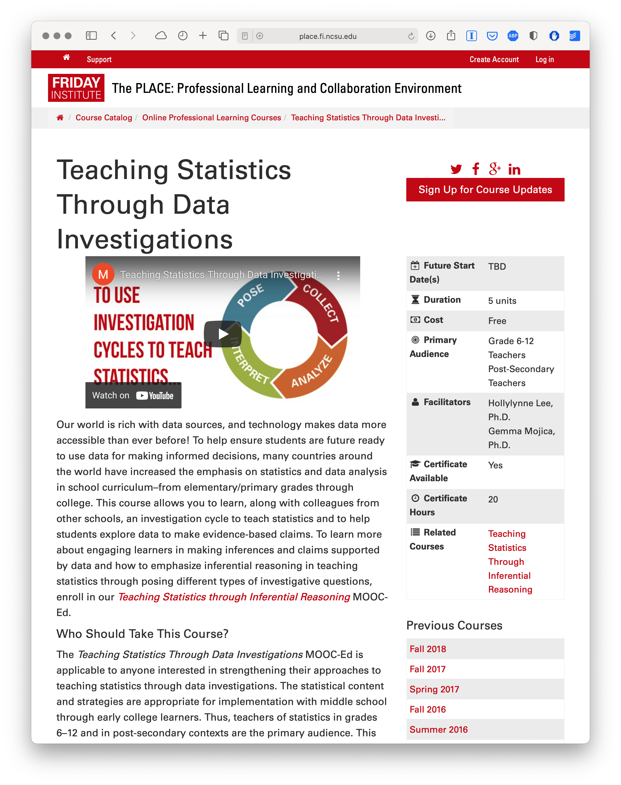

```{r setup, include=FALSE}
knitr::opts_chunk$set(echo = TRUE)
```

## 0. INTRODUCTION

The Unit 3 walkthrough extends previous research and evaluation work by myself and colleagues at the Friday Institute for Educational Innovation at North Carolina State University. In addition to may other areas inquiry, our work was aimed at understanding and improving peer interaction and discussion in the Friday Institute's Massively Open Online Courses for Educators (MOOC-Ed) and Online Professional Learning programs. To learn more about these courses and programs, visit: <https://place.fi.ncsu.edu>

### Walkthrough Focus

Our focus this week will be on identifying "topics" by examining how words cohere into different latent themes based on patterns of co-occurrence of words within documents. With a bit of tongue-in-cheek, [Meeks and Weingart (2012)](http://journalofdigitalhumanities.org/2-1/dh-contribution-to-topic-modeling/) describe topic modeling as: 

> *"...focused on corpora and not individual texts, treating the works themselves as unceremonious 'buckets of words,' and providing seductive but obscure results in the forms of easily interpreted (and manipulated) 'topics'.... To achieve its results, it leverages occult statistical methods like 'dirichlet priors' and 'bayesian models.'"*

That being said, [Weingart](Topic%20Modeling%20for%20Humanists%20post(opens%20in%20new%20window):) also noted that "a topic model is a "clever and exceptionally versatile little algorithm that can be customized to all sorts of applications, and a tool that many digital humanists would do well to have in their toolbox."

With respect to the actual R workflow of applying topic models to documents and text of interests, Silge & Robinson and a new bottom row their flowchart consisting new data structures (i.e. a corpus object and document-term matrix) and and the LDA model:  

[{width="90%"}](https://www.tidytextmining.com/topicmodeling.html)

This week will be also be our first introduction to the "Model" process of the data-intensive workflow described in our course text, [*Learning Analytics Goes to School*](https://catalog.lib.ncsu.edu/catalog/NCSU4862134)*.* As noted by Krumm and Means, this workflow is not always a linear process and there is often a great deal of iteration that occurs from wrangling to exploring to modeling. As illustrated below by our workflow below, this week we will explore our data post modeling in order to gain some additional insight into the topics generated by our model and cover the following concepts and skills:

1.  **Prepare**: Prior to analysis, we'll take a quick look at some of the related MOOC-Ed research and evaluation work to gain some context for out analysis. This should aid in the interpretation of our results and help guide some decisions as we tidy, model, and visualize our data.
2.  **Wrangle**: In section 2 we again revisit tidying and tokenizing text using the `tidytext` package, but are also introduced to the the `stm` package. This package makes use of `tm` text mining package to preprocess text and will also be our first introduction to word stemming.
3.  **Model**: For Unit 3, were take a look at two different approaches to topic modeling: Latent Dirichlet Allocation (LDA) and Structural Topic Modeling (STM), which is very similar to LDA but can use metadata about documents to improve the assignment of words to latent themes or "topics" in a corpus. 
4.  **Explore**: To further explore the results of our topic model, we use two handy functions included the `stm` package. The `findThoughts` function for viewing documents assigned to a given topic and the `toLDAvis` function for exploring topic and word distributions using topic browser from the `LDAvis` package.
5.  **Communicate:** Finally, in Week 10 we'll create a basic presentation, report, or other data product for sharing findings and insights from our analysis.

------------------------------------------------------------------------

## 1. PREPARE

To help us better understand the context, questions, and data sources we'll be using in Unit 3, this section will focus on the following topics:

a.  **Context**. We take a quick look at the Rosenberg et al. (2021) article, *Advancing new methods for understanding public sentiment about educational reforms*, including the purpose of the study, questions explored, and findings.
b.  **Questions.** We'll formulate some basic questions that we'll use to guide our analysis, attempting to replicate some of the findings by Rosenberg et al.
c.  **Twitter Setup** We walkthrough the process of setting up R to pull data from our Twitter developer account created during the first week of the course.

### 1a. Context

#### Participating in a MOOC and Professional Learning Team: How a Blended Approach to Professional Development Makes a Difference

[{width="50%"}](https://place.fi.ncsu.edu/local/catalog/course.php?id=4&ref=1)

Full text: <https://www.learntechlib.org/p/195234/>

**Abstract**

Massive open online course for educators (MOOC-Ed) provide opportunities for using research-based learning and teaching practices, along with new technological tools and facilitation approaches for delivering quality online professional development. The Teaching Statistics Through Data Investigations MOOC-Ed was built for preparing teachers in pedagogy for teaching statistics, and it has been offered to participants from around the world. During 2016-2017, professional learning teams (PLTs) were formed from a subset of MOOC-Ed participants. These teams met several times to share and discuss their learning and experiences. This study focused on examining the ways that a blended approach to professional development may result in similar or different patterns of engagement to those who only participate in a large-scale online course. Results show the benefits of a blended learning environment for retention, engagement with course materials, and connectedness within the online community of learners in an online professional development on teaching statistics. The findings suggest the use of self-forming autonomous PLTs for supporting a deeper and more comprehensive experience with self-directed online professional developments such as MOOCs. Other online professional development courses, such as MOOCs, may benefit from purposely suggesting and advertising, and perhaps facilitating, the formation of small face-to-face or virtual PLTs who commit to engage in learning together.

**Data Source & Analysis**

**Summary of Key Findings**

1.  Contrasting with sentiment about CSSS, sentiment about the NGSS science education reform effort is overwhelmingly positive, with approximately 9 positive tweets for every negative tweet.
2.  Teachers were more positive than non-teachers, and sentiment became substantially more positive over the ten years of NGSS-related posts.
3.  Differences between the context of the tweets were small, but those that did not include the \#NGSSchat hashtag became more positive over time than those posts that did not include the hashtag.
4.  Individuals posted more tweets during \#NGSSchat chats, the sentiment of their posts was more positive, suggesting that while the context of individual tweets has a small effect (with posts not including the hashtag becoming more positive over time), the effect upon individuals of being involved in the \#NGSSchat was positive.

### 1b. Guiding Questions

The Rosenberg et al. study was guided by the following five research questions:

1.  What is the public sentiment expressed toward the NGSS?
2.  How does sentiment for teachers differ from non-teachers?
3.  How do tweets posted to \#NGSSchat differ from those without the hashtag?
4.  How does participation in \#NGSSchat relate to the public sentiment individuals express?
5.  How does public sentiment vary over time?

For this walkthrough, we'll use a similar approach used by the authors to guage public sentiment around the NGSS, by compare how much more positive or negative NGSS tweets are relative to CSSS tweets.

Our (very) specific questions of interest for this walkthrough are:

1.  What is the public sentiment expressed toward the NGSS?
2.  How does sentiment for NGSS compare to sentiment for CCSS?

And just to reiterate from Unit 1, one overarching question we'll explore throughout this course, and that Silge and Robinson (2018) identify as a central question to text mining and natural language processing, is:

> How do we to **quantify** what a document or collection of documents is about?

### 1c. Set Up

As highlighted in [Chapter 6 of Data Science in Education Using R](https://datascienceineducation.com/c06.html) (DSIEUR), one of the first steps of every workflow should be to set up a "Project" within RStudio. This will be your "home" for any files and code used or created in Unit 2. You are welcome to continue using the same project created for Unit 1, or create an entirely new project for Unit 2. However, after you've created your project open up a new R script, and load the following packages that we'll be needing for this walkthrough:

```{r, message=FALSE}
library(dplyr)
library(readr)
library(tidyr)
library(rtweet)
library(writexl)
library(readxl)
library(tidytext)
library(textdata)
library(ggplot2)
library(textdata)
library(scales)
```

At the end of this week, I'll ask that you share with me your r script as evidence that you have complete the walkthrough. Although I highly recommend that that you manually type the code shared throughout this walkthrough, for large blocks of text it may be easier to copy and paste.

------------------------------------------------------------------------
